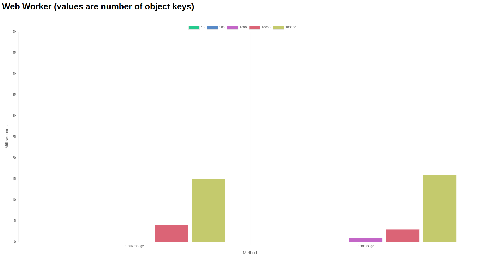
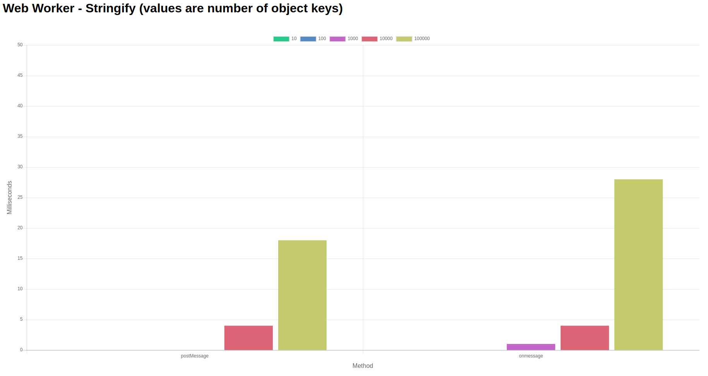

> This is advance staff, you don't really need it to be great developer, so don't be bothered if you don't get everything at the beginning. Reading this makes you more aware than maybe 90% of all JS devs :) 

Throughout the years, JavaScript was considered being slow and mostly used as a "helper" for displaying web content. That has changed around 2010 when frameworks like AngularJS or BackboneJS started appearing. Developers and companies start to realise that you can perform complex operations on your user's computer. But with more and more code on the frontend, some pages started to slow down.

Main reason was JS being single threaded. We had Even Loop, but that wasn't helping with long executing functions. You could still block user's thread with some calculations. The main goal is to achieve 60FPS (Frames Per Second). That means you have only 16ms to execute your code before next frame.

Solution for this problem is to use [Web Workers](https://developer.mozilla.org/en-US/docs/Web/API/Web_Workers_API), where you can perform long running tasks without affecting main thread of execution. There is just one main problem with Workers, sending data...

### How do we exchange data with Worker?

For those new to idea of workers usually, communication between main thread and worker looks like that:

```js
// main.js
const myWorker = new Worker('worker.js');

myWorker.onmessage = function(e) {
  doSthWithResult(e.data);
};

myWorker.postMessage({
  attr1: 'data1',
  attr2: 'data2',
});
```

```js
// worker.js
onmessage = function(e) {
  // Message received from main thread in e.data
  postMessage(getResultOfComplexOperation(e.data));
};
```

As you can see, there is a lot of data sent both ways. In this example we're sending simple a object, and it won't cause any performance issues. But if you try to pass object with thousands of keys, it's going to slow down. Why? Because every time we send sth to Worker, [Structured Clone Algorithm](http://w3c.github.io/html/infrastructure.html#safe-passing-of-structured-data) has to be called to clone that object. For those who don't want to read the whole spec :P, it's simply recursing through a given object and creates a clone of it.

In this point you probably could notice what kind of issue we're going to have. When sending large data structures or sending smaller ones by quite often, we might end up waiting for responses longer than our 16ms. Here is a simple benchmark done on my computer:





Thanks to [James Milner](https://github.com/JamesMilnerUK) for creating [Benchmark for Web Workers](https://github.com/JamesMilnerUK/webworker-perf), if you want, you can try it on your browser and see the results.

Couple years (2016) ago there was an idea to always parse objects `JSON.stringify(objectToSend)`. Reason for that was sending strings was a lot faster than sending objects. That's not the case anymore (as presented).

Those results are only for one message and remember that in most of the scenarios you want to send multiple messages within one frame. Even if size of 100k keys object may look huge, if you take time to post 1k keys object (0.725ms \* 2 on my machine) and post it 10 times, you'll get 14.5ms.

### How we could improve our processing then?

People might say that JS is multi threaded (because it has Workers) but imho real multi threading requires something more than ability to execute part of code on the different thread. That something is shared memory. If I have to copy and paste my whole data structure every time, I want to make some changes. It defeats whole idea of running it on separate workers. But as usual there is a solution for that and it's called [SharedArrayBuffer](https://developer.mozilla.org/en-US/docs/Web/JavaScript/Reference/Global_Objects/SharedArrayBuffer).

As of today, this feature is supported on Chrome, Firefox and Node (=>8.10.x). Why only those browsers you might ask? Reason for that is, in Jan 2018 there was an exploit called [Spectre](https://meltdownattack.com/) which basically forced all major browsers to remove the feature from engines. Chrome reintroduced it in V67 but some browsers just postponed implementation (Edge, Safari).

Ok but what `SharedArrayBuffer` exactly is? You can check [specification](http://www.ecma-international.org/ecma-262/#sec-sharedarraybuffer-objects) if you want, but getting the explanation from there is time consuming. MDN explains it in a more simple way:

> The SharedArrayBuffer object is used to represent a generic, fixed-length raw binary data buffer

How is this going to help me with data problem? Instead of sending data and copying it from main thread we can update the same shared memory on both sides. First you need to spot a difference between Buffer and an actual Array:

```js
// main.js

// Create Buffer for 32 16-bit integers
const myBuffer = new SharedArrayBuffer(Int16Array.BYTES_PER_ELEMENT * 32);

// create array available in main thread using our buffer
const mainThreadArray = new Int16Array(myBuffer);

// post our buffer to Worker
myWorker.postMessage(myBuffer);
```

When the worker receives buffer on its thread, we can create another array using the same buffer

```js
// worker.js
const workerArray = new Int16Array(e.data);
```

Now we have reference to the same memory in both threads, only thing left to do is to being able to update those values.

### [Atomics](http://www.ecma-international.org/ecma-262/#sec-atomics-object) for the win!

When sharing memory between multiple threads we might end up with [Race Condition](https://en.wikipedia.org/wiki/Race_condition) issue. To put it simply, a race condition is when multiple threads tries to change the same data at the same time. It's like if you have multiple light switches in your home. If two people want to do the same action (turn off the light), the result of that action won't be as they expected (light stays turned on). I know that explanation doesn't fully explain what is a race condition, but it's not a time or place to do it.

> The Atomics object provides functions that operate indivisibly (atomically) on shared memory array cells as well as functions that let agents wait for and dispatch primitive events. When used with discipline, the Atomics functions allow multi-agent programs that communicate through shared memory to execute in a well-understood order even on parallel CPUs.

That's a definition form current JS Spec (ECMA-262, 10th edition, June 2019). Another word Atomics allows you to operate on shared data in the predictable way. Ok, let's write some code:

```js
// main.js
const worker = new Worker('worker.js');

// Create Buffer for 32 16-bit integers
const myBuffer = new SharedArrayBuffer(Int16Array.BYTES_PER_ELEMENT * 32);

// create array available in main thread using our buffer
const mainThreadArray = new Int16Array(myBuffer);
for (let i = 0; i < mainThreadArray.length; i += 1) {
  Atomics.store(mainThreadArray, i, i + 5);
}

worker.postMessage(myBuffer);
```

```js
// worker.js
self.onmessage = event => {
  const workerThreadArray = new Int16Array(event.data);
  for (let i = 0; i < workerThreadArray.length; i += 1) {
    const currentVal = Atomics.load(workerThreadArray, i);
    console.log(`Index ${i} has value: ${currentVal}`);
  }
};
```

Result of that code is just 32 console logs (`workerThreadArray.length` is 32) with values from our buffer.

You can check it for yourself on [codesandbox](https://codesandbox.io/s/competent-gould-r2mzv?fontsize=14&module=%2Fsrc%2Findex.js&view=editor) (remember to open dev tools instead of builtin console ,because their console doesn't log worker threads).

If simple read/write is not enough, then you can do sth more:

#### [Exchange](https://developer.mozilla.org/en-US/docs/Web/JavaScript/Reference/Global_Objects/Atomics/exchange)

Receive previous value when storing a new one.

```js
// worker.js
self.onmessage = event => {
  const workerThreadArray = new Int16Array(event.data);
  for (let i = 0; i < workerThreadArray.length; i += 1) {
    const previousValue = Atomics.exchange(workerThreadArray, i, 0);
    console.log(`Index ${i} had value: ${previousValue}`);
  }
};
```

#### [CompareExchange](https://developer.mozilla.org/en-US/docs/Web/JavaScript/Reference/Global_Objects/Atomics/compareExchange)

Works like `exchange` but only replaces value if there is a match

```js
// worker.js
self.onmessage = event => {
  const workerThreadArray = new Int16Array(event.data);
  // Remember that value at position 0 is 5 (i + 5)
  const previousValue1 = Atomics.compareExchange(workerThreadArray, 0, 5, 2);
  console.log(`Index 0 has value: ${Atomics.load(workerThreadArray, 0)}`);
  console.log(`Value received: ${previousValue1}`);
  const previousValue2 = Atomics.compareExchange(workerThreadArray, 0, 5, 1);
  console.log(`Index 0 has value: ${Atomics.load(workerThreadArray, 0)}`);
  console.log(`Value received: ${previousValue2}`);
};
```
it will print:
```
Index 0 has value: 2
Value received: 5
Index 0 has value: 2
Value received: 2
```
Because default value is `5` then first run matches value (second argument) and replaces it with `2` (third argument). So function returns previous value (like in `exchange`). Next run fails because existing value is not `5` so function returns existing value and doesn't replace it with `1`.

Here is a list of all operations available on Atomics (as of Jul 2019):
 - [add](https://developer.mozilla.org/en-US/docs/Web/JavaScript/Reference/Global_Objects/Atomics/add)
 - [sub](https://developer.mozilla.org/en-US/docs/Web/JavaScript/Reference/Global_Objects/Atomics/sub)
 - [and](https://developer.mozilla.org/en-US/docs/Web/JavaScript/Reference/Global_Objects/Atomics/and)
 - [or](https://developer.mozilla.org/en-US/docs/Web/JavaScript/Reference/Global_Objects/Atomics/or)
 - [xor](https://developer.mozilla.org/en-US/docs/Web/JavaScript/Reference/Global_Objects/Atomics/xor)
 - [exchange](https://developer.mozilla.org/en-US/docs/Web/JavaScript/Reference/Global_Objects/Atomics/exchange)
 - [compareExchange](https://developer.mozilla.org/en-US/docs/Web/JavaScript/Reference/Global_Objects/Atomics/compareExchange)
 - [load](https://developer.mozilla.org/en-US/docs/Web/JavaScript/Reference/Global_Objects/Atomics/load)
 - [store](https://developer.mozilla.org/en-US/docs/Web/JavaScript/Reference/Global_Objects/Atomics/store)
 
### Observables?

Atomics are not restricted to only read/write operations. Sometimes multi threaded operations require you to watch and respond to changes. That's why functions like `wait` and `notify` were introduced. 

#### Wait (works with Int32Array only)

If you're familiar with `await` then you can treat it as "conditional" `await`.

```js
// worker.js
const result = Atomics.wait(workerThreadArray, 0, 5);
console.log(result);
```

This code will wait until someone notifies `wait` about change. To do that, you have to call `notify` from another thread (current one is blocked).

```js
// main.js
Atomics.notify(mainThreadArray, 0, 1);
```

In this case `wait` returns `ok` because there was no value change. Code will proceed like it `await` case.

There are 3 types of the return message `ok`, `not-equal` and `timed-out`. First one is covered, Second one is returned when there was a value change during the wait period. Third one could be returned when we pass 4th parameter to `wait` function

```js
// worker.js
const result = Atomics.wait(workerThreadArray, 0, 5, 1000);
console.log(result);
```

After 1000ms `wait` returns `timed-out` when nothing else causes it to stop.

I think there is one more thing to add about `notify`. 3rd parameter in the function call is responsible for number of waiting agents to notify. If you want to notify them all then just set value to `+Infinity` or leave it empty (defaults to `+Infinity`).

There is one more function in Atomics called [Atomics.isLockFree(size)](http://www.ecma-international.org/ecma-262/#sec-atomics.islockfree) but we're not going to cover it here.

### What about strings?

Currently, there is no support for strings but commonly used solution is just to parse string into its numeric representation. I know it's not the best solution but until we get string support, we have to deal with it :(

### Conclusions

Multi threading in JavaScript is the real right now. You can offload your work into multiple threads and share memory between them. To be honest, I wasn't really sure if that's going to be possible couple years ago. Mostly because of JS specification. I think an idea of `SharedArrayBuffers` and multithreading is beneficial especially if it comes to NodeJS services. I know that support for [Worker Threads](https://nodejs.org/api/worker_threads.html) is still in the experimental phase (Node 12.6.0) but with a little effort we can create high efficient services. I think in the nearest future we'll see more and more multithreaded solutions across the web.