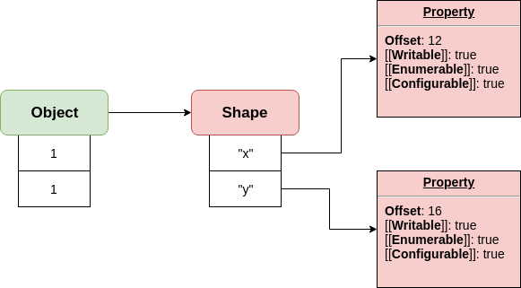
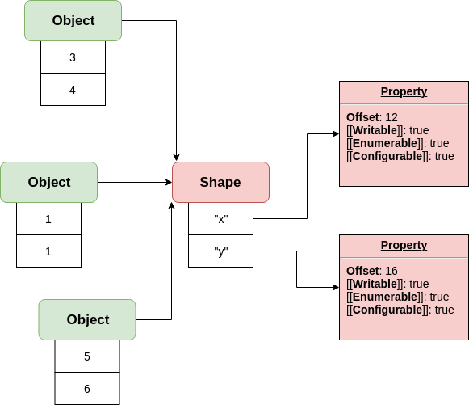
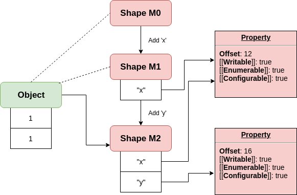
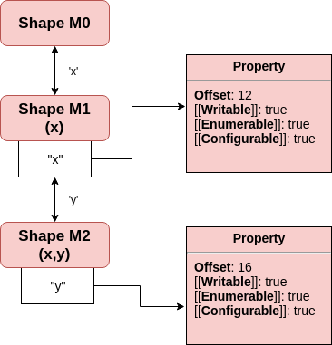
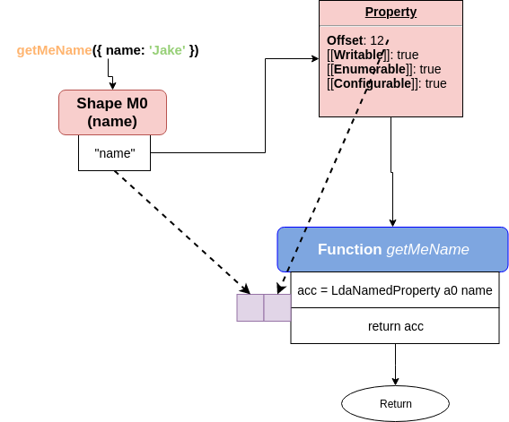
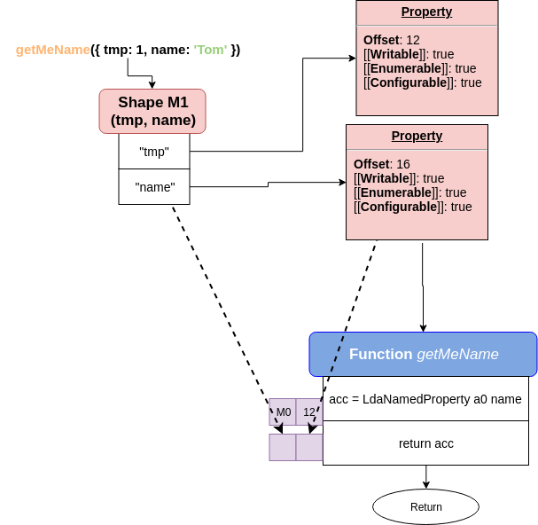
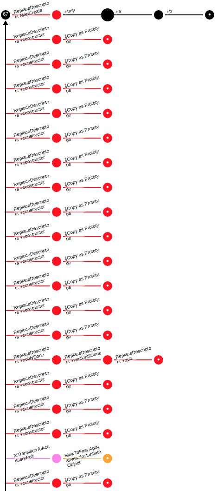

## Setup (optional)

> If you don't want to run it on your computer please skip to [this section](#what-are-we-trying-to-optimize)

First we need to install V8 to be able to run it without whole package (node or web browser). I've created gist describing process for Linux users.

<a href="https://gist.github.com/burnpiro/d85d836200df93af892877c2cf37f12c" target="_blank">https://gist.github.com/burnpiro/d85d836200df93af892877c2cf37f12c</a>

If you're a Mac user it should apply to you as well. If you have any problems with installation process please refer to [Official Docs](https://v8.dev/docs/build)

After installing you should be able to run code like

```javascript
// index.js

console.log('it works');
```

by calling

```bash
d8 index.js
```

## What are we trying to optimize?

Our test function looks like that:

```javascript
function test(obj: any): string {
  let result = '';
  for (let i = 0; i < N; i += 1) {
    result += obj.a + obj.b;
  }
  return result;
}
```

Let's assume this function is called thousands of times during our script execution so it's important to run quickly. Before I explain how that is optimized in V8 we need to know what are Shapes and how Inline Cache (IC) works.

## Shapes (Maps in V8)

> Academic name of the Shape is "Hidden Class" which might be confusing especially in JS so everyone calls it differently, but name introduced by FF team is probably best.

`Shape` contain a lot of staff, but when people use that name they mostly referring to it as a table of `descriptors` for object properties. Shape stores other information as well, like size of the object and pointers to constructors and prototypes. I'm going to show you that in the example soon.

Let's start with simple object:

```javascript
const obj = {
  x: 1,
  y: 1,
};
```

It's representation in V8 looks like



If you look on it, there is obvious distinction between object values and their description. Every property on that object is stored in memory according to `offset` defined in shape. In out case property `x` is stored with `offset: 12` which tells v8 to look for `obj.x` value by offsetting pointer by 12.


Ok, so now you know what a Shape is but why is it so useful?

### Shape's usefulness

When you create object you don't really want to store all information about it again if you have similar object in your system. That's why V8 is reusing it's shapes.



code responsible for this situation might look like

```javascript
const obj1 = {
  x: 1,
  y: 1,
};
const obj2 = {
  x: 3,
  y: 4,
};
const obj3 = {
  x: 5,
  y: 6,
};
```

### Not all objects with the same "structure" have the same Shape

If you compare these two objects

```javascript
const obj1 = {
  x: 1,
  y: 1,
};
const obj2 = {};
obj2.x = 1;
obj2.y = 1;
```

they might look the same, but they have different shape. Shape of the first one we've already discussed. Shape of the second one is here



During code execution V8 is creating 3 different shapes and transitions between them to describe end result.

```javascript
const obj2 = {};
// Shape M0
// add "x": Transition to M1, offset 12

obj2.x = 1;
// Shape M1
// "x": at offset 12
// add "y": Transition to M2, offset 16

obj2.y = 1;
// Shape M2
// "x": at offset 12
// "y": at offset 16
```

the same goes when you creating classes

```javascript
class MyComponent {
  constructor(size, name) {
    // Shape M0

    this.size = size;
    // Shape M1
    // "size": at some offset

    this.name = name;
    // Shape M2
    // "size": at some offset
    // "name": at some other offset
  }
}
```

To be 100% honest V8 doesn't store whole shapes when it does transitions between them.



It doesn't copy information about `x` property into `Shape M2`. That allows it to be shaped in tree like structure when having different objects.

```javascript
const obj1 = {};
obj1.x = 1;
const obj2 = {};
obj2.x = 1;
obj2.y = 1;
const obj3 = {};
obj3.x = 1;
obj3.z = 1;
obj3.k = 1;
const obj4 = {};
obj4.i = 1;
obj4.j = 'test';
obj4.k = 1;
```


Notice that even if we using the same attribute name as 3rd property, in `obj3` and `obj4`, these are two different shapes. Reason for that is because shape is related to transition. If you could have global shape that represents `k` property, it requires defined `offset` property. That might work with the same object structures in memory (offset is set base on how much space rest of the object takes before property). So if you have object like `obj4` then property `k` might have a different offset than property `k` on `obj3` (transition to Shape M7 is different).

## Inline Cache (IC)

Maybe start with some code this time?

```javascript
const N = 1000000;
const obj1 = {};
obj1.name = 'Jake';

function getMeName(o) {
  return o.name;
}

for (let i = 0; i < N; i += 1) {
  getMeName(obj1);
}
```

and then run this code like

```bash
d8 --trace-ic index.js
```

> Offtopic: you might wonder why we're running function that many times. It's because V8 won't try to optimise function unless that function is marked as `hot`. And you get `hot` status when running function many times.

Now you can open `path/to/v8/tools/ic-explorer.html` in your browser. That page allows you to explore what is happening with inline cache.


Important part of it is `state` which can be one of the following states:

- 0 uninitialized
- . premonomorphic
- 1 monomorphic
- ^ recompute handler
- P polymorphic
- N megamorphic
- G generic

In our case `state` is set to be monomorphic which means that function is optimized to receive only objects with one defined shape.

Now let's define what IC really is...

Unfortunately we have to do it in the hard way. By looking into some bytecode (There's a [blog post](https://medium.com/dailyjs/understanding-v8s-bytecode-317d46c94775) about understanding bytecode by [Franziska Hinkelmann](https://twitter.com/fhinkel) if you're interested). To do that just run

```bash
d8 --print-bytecode index.js
```

Output of that is quite long but we're interested in last part. Look for `generated bytecode for function getMeName`.

```
...
[generated bytecode for function: getMeName]
Parameter count 2
Register count 0
Frame size 0
   69 E> 0x2d34c959f9d6 @    0 : a5                StackCheck
   86 S> 0x2d34c959f9d7 @    1 : 28 02 00 00       LdaNamedProperty a0, [0], [0]
   91 S> 0x2d34c959f9db @    5 : a9                Return
Constant pool (size = 1)
0x2d34c959f989: [FixedArray] in OldSpace
 - map: 0x0741c8840789 <Map>
 - length: 1
           0: 0x0741c8843eb9 <String[#4]: name>
Handler Table (size = 0)
```

Take a look on `LdaNamedProperty`. This method is responsible for extracting named property from `a0`(argument 0). Property name (in our case `name`) is determined by `[0]` constant from `Constant pool`.

```
 - map: 0x0741c8840789 <Map>
 - length: 1
           0: 0x0741c8843eb9 <String[#4]: name>
```

After getting property value form argument, function stores it in accumulator (function returns accumulator at the end).

That process generates sth we call `Inline Cache` (`IC`). Every time function runs with different object shape it creates new IC entry.



We've called `getMeName` with object that has given shape M0. First run of the function works as described before so V8 has to look up for named property on `a0` and store it into `acc`. After running bytecode it creates IC which contain two things:

- Shape
- Way to get to property

Now if we call the same function again with object that has the mame shape:


V8 compares current shape with shape stored in IC and skipping whole process of calling `LdaNamedProperty`, because there is a "shortcut" for this "kind" of shape, stored in IC. That way we have nice optimisation of function call. But what if we call that function with different object (with different shape)?



V8 created another IC for shape M1. After that we have "shortcut" for two types of shapes. But how many IC can V8 create for one function? A lot... only problem is, every time it does that there is a deoptimization going one.

### Function states

There are different states your function can be in, but we're mostly interested in 3 of them:

- Monomorphic - 1 IC
- Polymorphic - 2-4 IC
- Megamorphic - >5 IC

While V8 decides if function should be optimized, it check current function state. Only two of them can be optimized: Monomorphic and Polymorphic. Reaching 5 ICs V8 basically means **_"I have no idea what I'm going, so call it a day"_**. At this point **TurboFan** is not going to store anything into IC, instead it fall back to global cache. Usually it doesn't matter if your function is Megamorphic, but if that function runs very often you might thing about optimizing it by reducing number of different shapes it accepts.

## Back to our function

```javascript
const N = 10000;

let a = { a: 'Jack', b: 'Sparrow' };
let b = { tmp: 3, a: 'Charles', b: 'Xavier' };
let c = { tmp: 3, tmp2: 3, a: 'Frodo', b: 'Baggins' };
let d = { tmp: 3, tmp2: 3, tmp3: 3, a: 'Legolas', b: 'Thranduilion' };
let e = { tmp: 3, tmp2: 3, tmp3: 3, tmp4: 3, a: 'Indiana', b: 'Jones' };
let f = { tmp: 3, tmp2: 3, tmp3: 3, tmp4: 3, tmp5: 3, a: 'Gandalf', b: 'The Grey' };
let f2 = { tmp: 3, tmp2: 3, tmp3: 3, tmp4: 3, tmp5: 3, a: 'Jack', b: 'Sparrow' };
let f3 = { tmp: 3, tmp2: 3, tmp3: 3, tmp4: 3, tmp5: 3, a: 'Charles', b: 'Xavier' };
let f4 = { tmp: 3, tmp2: 3, tmp3: 3, tmp4: 3, tmp5: 3, a: 'Frodo', b: 'Baggins' };
let f5 = { tmp: 3, tmp2: 3, tmp3: 3, tmp4: 3, tmp5: 3, a: 'Legolas', b: 'Thranduilion' };
let f6 = { tmp: 3, tmp2: 3, tmp3: 3, tmp4: 3, tmp5: 3, a: 'Indiana', b: 'Jones' };

function test(obj) {
  let result = '';
  for (let i = 0; i < N; i += 1) {
    result += obj.a + obj.b;
  }
  return result;
}
function test2(obj) {
  let result = '';
  for (let i = 0; i < N; i += 1) {
    result += obj.a + obj.b;
  }
  return result;
}

const startT1 = Date.now();
for(let i = 0; i < N; i += 1) {
	test(f);
	test(f2);
	test(f3);
	test(f4);
	test(f5);
	test(f6);
}
console.log("test with one shape:", Date.now() - startT1, "ms.");

const startT2 = Date.now();
for(let i = 0; i < N; i += 1) {
	test2(a);
	test2(b);
	test2(c);
	test2(d);
	test2(e);
	test2(f);
}
console.log("test with multiple shape:", Date.now() - startT2, "ms.");
```

After executing this code it prints:
```
test with one shape: 3015 ms.
test with multiple shape: 12329 ms.
```

What just happen? First of all we've set number of operations to 6*10^8 for every test (6 x 10000 x 10000). First function `test` is called with the same shape all over again (different objects, same shape). Second function `test2` is called with 6 different shapes and because of that V8 is not optimising it.

If you open `v8/tools/ic-explorer.html` and run above code with `d8 --trace-ic index.js`. You could be able to load `v8.log` into `ic-explorer`. For those who don't want to do it, here is a screenshot.

`test(obj)`:


`test2(obj)`:


Result of that test is obvious and `test()` runs 7.8 times faster than `test2()`.

You might ask why creating `test2()` if it looks the same? It's because after running `test()` with one shape it's already optimised for it. I didn't want to affect performance of second run, but still want to keep it in one file.


## Extra

I've mentioned that shape contains more than just information about added properties. Here is an example of created shape for `let b`:



If you want you can generate that for your code by running
```bash
d8 --trace-maps index.js
```

and uploading `v8.log` into `v8/tools/map-processor.html`. When it generates chart, click on `Transitions` and explore list of them at the bottom of the page.