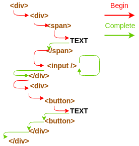
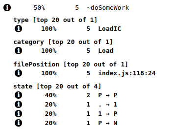

> This post requires basic knowledge about Shapes and Inline Cache. If you didn't read [V8 function optimization](/2019/08/v-8-function-optimization) it might be difficult to follow this one.

Every time someones talk about "performance" in React it's usually about virtual DOM. It is important piece of react but we're going to focus on sth else today (still connected).

## Fibers

In 2017 on F8 conference React announced major rewrite of their core algorithm. That's where `Fiber` comes from. But what that exactly is?

A `Fiber` is work on a Component that needs to be done or was done. (another words "wrapper for processing"). There are different ways to create Fibers but all of them have the same data structure (that's important for us). These are only some of them:

```javascript
createWorkInProgress
createHostRootFiber
createFiberFromTypeAndProps
createFiberFromElement
createFiberFromFragment
...
```

> You can check how Fiber looks <a href="https://github.com/facebook/react/blob/master/packages/react-reconciler/src/ReactFiber.js#L118" target="_blank">right here</a>

We're not going to go deep into Fiber internals (maybe next time). What is important is that React uses those containers instead of operating on components directly.

Now let's see that react does when we return JSX:

```javascript
return <Layout>{children}</Layout>;
```

that transforms it into:

```javascript
React.createElement(Layout, props, children);
```

and creates ReactElement which is just another kind of container.

## Simplify React internals

I'm going to simplify React's internal structure a little bit, to make is easier to understand what it does. In addition to that I'm going to use class instead of function for `FiberNode`:

```javascript
class Component {
  constructor() {
    this.name = 'Component';
  }

  render() {}
}

class MyComponent1 extends Component {
  render() {
    return '<span>Test 1</span>';
  }
}

class MyComponent2 extends Component {
  render() {
    return '<span>Test 2</span>';
  }
}

class MyComponent3 extends Component {
  render() {
    return '<span>Test 3</span>';
  }
}

function createElement(element, ...rest) {
  return {
    type: element,
  };
}
```

That's our component classes which should look familiar and `createElement` which returns Element like structure (oversimplified).

```javascript
const ReactWorkTags = {
  ClassComponent: 1,
  HostComponent: 5,
};

class FiberNode {
  constructor(tag, ...rest) {
    this.tag = tag;
    // Other important staff...
  }
}

const createFiberFromElement = function(element, ...rest) {
  // another simplification, there are different WorkTags
  const fiberTag =
    typeof element.type === 'string'
      ? ReactWorkTags.HostComponent
      : ReactWorkTags.ClassComponent;
  const fiber = new FiberNode(fiberTag, ...rest);
  fiber.type = element.type;

  return fiber;
};
```

Here we have definition of our `FiberNode` and one way it could be created. It's important to know that when passing our element, FiberNode created from that element has the same shape as any other FiberNode (even if we're using different component types).

```javascript
const comp1 = createElement(MyComponent1);
const comp2 = createElement(MyComponent2);
const comp3 = createElement(MyComponent3);
const comp4 = createElement('div');

const fiber1 = createFiberFromElement(comp1);
const fiber2 = createFiberFromElement(comp2);
const fiber3 = createFiberFromElement(comp3);
const fiber4 = createFiberFromElement(comp4);

console.log(%HaveSameMap(fiber1, fiber2)); // true
console.log(%HaveSameMap(fiber1, fiber3)); // true
console.log(%HaveSameMap(fiber1, fiber4)); // true
console.log(%HaveSameMap(fiber2, fiber3)); // true
console.log(%HaveSameMap(fiber2, fiber4)); // true
console.log(%HaveSameMap(fiber3, fiber4)); // true
```

What would happen if you just generate those components manually and assign additional properties to it?

```javascript
const comp1 = new MyComponent1();
const comp2 = new MyComponent2();

console.log(%HaveSameMap(comp1, comp2)); // false
```

## How that helps us run code faster

As you might know every time there is a change in React, it has to go through reconciliation process. Reconciliation is using fibers to figure out next tree. How it works?

Inside `ReactFiberWorkLoop` everything goes into `workLoopSync` (or `workLoop`). After that `performUnitOfWork` is called with "top" Fiber. `performUnitOfWork` is doing one of three things:

- nothing
- calls `beginWork` with current `unitOfWork` (Fiber)
- calls `completeUnitOfWork` with current `unitOfWork` (also Fiber)

at the end it returns null or result of one of those two functions (surprise... it's Fiber).

From this point reconciler is just looping over all Fibers using `performUnitOfWork` and waits until `workInProgress` is empty.

What is important is that React not using recursion to go through the tree. They are using simple while loops to avoid having large stacks (maybe if we could get [PTC](https://github.com/tc39/proposal-ptc-syntax) into JS that would be different).

```
while(sthToDo !== null) {
    sthToDo = doSomeWork(sthToDo)
}
```



> React has extra optimization for simple "Text" nodes to avoid creating extra elements

That's where we could spot optimization in React structure.

Because all of it is complicated enough let's check how functions behave when they are called thousands of times with our simplified structure:

```javascript
function doSomeWork(unitOfWork) {
	let result = '';
    // I realize that is stupid but just to make a point of doing sth
	for(let i=0; i<1000; i += 1) {
		result += unitOfWork.name;
	}
	return unitOfWork.nextFiber;
}
```

I know we're not referring to returned unitOfWork but that's just to run `doSomeWork` many times.
```javascript
const N = 100000;

const startComp = Date.now();
for(let i=0; i<N; i += 1) {
	doSomeWork(comp1);
	doSomeWork(comp2);
	doSomeWork(comp3);
	doSomeWork(comp4);
	doSomeWork(comp5);
}
console.log("test with components:", Date.now() - startComp, "ms.");
```

```javascript
const N = 100000;

const startFiber = Date.now();
for(let i=0; i<N; i += 1) {
	doSomeWork(fiber1);
	doSomeWork(fiber2);
	doSomeWork(fiber3);
	doSomeWork(fiber4);
	doSomeWork(fiber5);
}
console.log("test with fibers:", Date.now() - startFiber, "ms.");
```

```
test with components: 4186 ms.
test with fibers: 2431 ms.
```

Why results are different? Mainly because of `FiberNode` wrapper. Every time function is called V8 creates sth called `Inline Cache` (IC). ICs are used to optimise function execution when object with the same `Shape` is passed into it. As you might remember our fibers have the same map:

```
console.log(%HaveSameMap(fiber1, fiber2)); // true
```

and our components haven't

```
console.log(%HaveSameMap(comp1, comp2)); // false
```

Because of that simple thing, V8 cannot optimise `doSomeWork` for components



but it can for fibers


If you take a look on screenshoots above, you can notice that first time V8 goes through `premonomorphic (.) -> monomorphic (1) -> polymorphic (P)-> megamorphic (N)` states but second one stays in `premonomorphic (.) -> monomorphic (1)` state. In my [previous post](/2019/08/v-8-function-optimization#back-to-our-function) I've described how optimisation works in V8. In this case we have to deal with **Megamorphic** function and that means it won't be optimised by the engine. On the other hand we have **Monomorphic** function which is optimised for given Shape (Fiber's Shape). So even with extra layer (more complicated object), function might execute faster.

## Conclusions

This is just one of many optimisations done inside React codebase. Reason for describing this one is because it's useful outside React. Angular is using the same approach with sth called `View Nodes`. You might even want to implement this kind of structure inside our own application.

I have to apologise for oversimplifying React structure. I really encourage you to check it out and see how workLoop actually works under the hood. My point was to show that even if you have to process a lot of different components there is a way to speed up function execution by creating "special" containers instead of passing components directly.

If you want to run that code on your machine <a href="https://gist.github.com/burnpiro/fec834b8473ffecd439ae5c98855bc61" target="_blank">check out this gist</a>. Feel free to modify components or `FiberNode` implementation and see what happens.

And ofc have a nice rest of the day :)