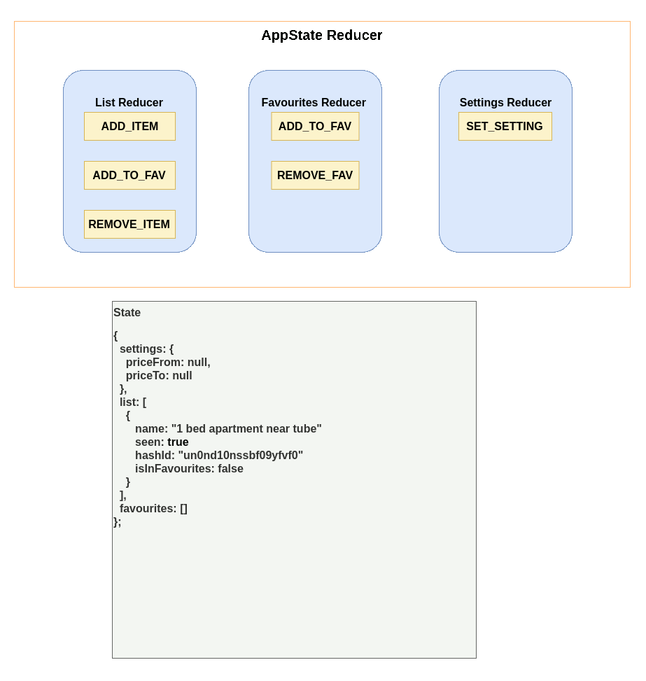
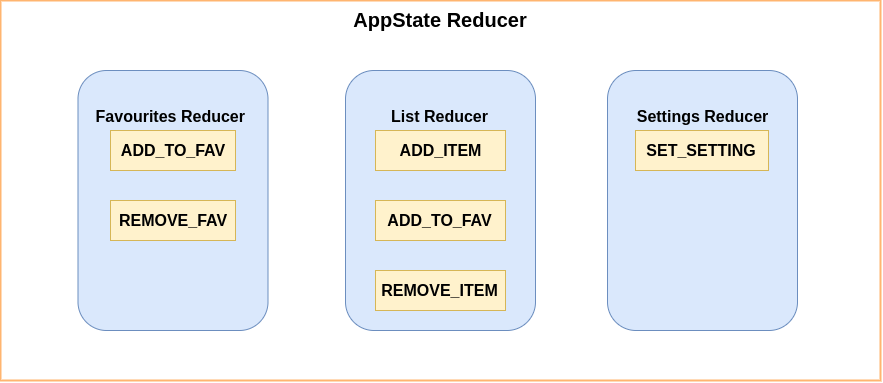
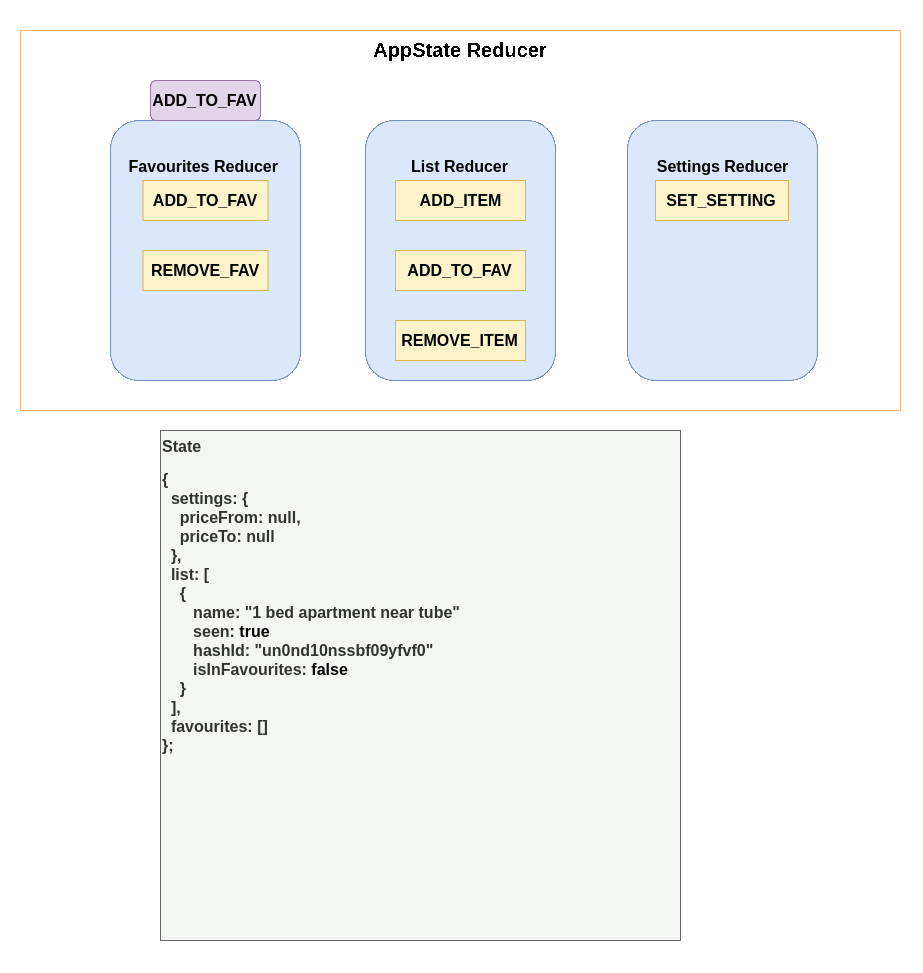
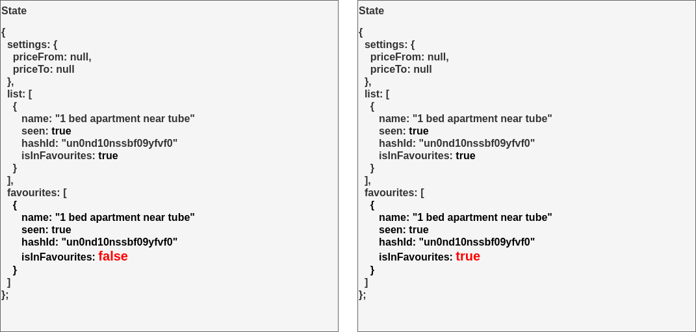

> It might be beneficial to have CodeSandbox editor opened when reading this blog post.

<iframe src="https://codesandbox.io/embed/mutable-dust-yggp9?fontsize=14" title="mutable-dust-yggp9" allow="geolocation; microphone; camera; midi; vr; accelerometer; gyroscope; payment; ambient-light-sensor; encrypted-media; usb" style="width:100%; height:500px; border:0; border-radius: 4px; overflow:hidden;" sandbox="allow-modals allow-forms allow-popups allow-scripts allow-same-origin"></iframe>

> This is a second part of "State management without libraries". If you didn't read first one, it might be difficult to follow this one, so please check out [Part 1](https://erdem.pl/2019/09/react-state-management-without-libraries-with-hooks)

## What is wrong with Part 1?

As you remember in the first part we've created `AppStateContext` that allows us to store our app state within React's **Context** and modify it using a reducer. The only problem with that one is **63**. That is a number of lines used to create our reducer. 

```typescript
// AppState.tsx
function reducer(state: AppState, action: ActionType) {
  const { type, payload } = action;
  switch (type) {
    case ACTIONS.SET:
      return {
        ...state,
        [payload.name as string]: payload.value
      };
    case ACTIONS.ADD_ITEM:
      return {
        ...state,
        list: [
          {
            ...payload,
            seen: false,
            isInFavourites: false,
            hashId: uuid()
          },
          ...state.list
        ]
      };
    case ACTIONS.ADD_TO_FAVOURITES:
      const el = state.list.find(el => el.hashId === payload);
      if (el == null || el.isInFavourites) {
        return state;
      }
      return {
        ...state,
        list: state.list.map(element => {
          if (element.hashId === payload) {
            return {
              ...element,
              isInFavourites: true
            };
          }
          return element;
        }),
        favourites: [
          {
            ...el,
            isInFavourites: true
          },
          ...state.favourites
        ]
      };

    case ACTIONS.REMOVE_FROM_FAVOURITES:
      return {
        ...state,
        list: state.list.map(element => {
          if (element.hashId === payload) {
            return {
              ...element,
              isInFavourites: false
            };
          }
          return element;
        }),
        favourites: state.favourites.filter(fav => fav.hashId !== payload)
      };
    default:
      throw new Error();
  }
}
```

That's fine, but after adding some more functionality to our app it grows linear. Because we don't want to end up with 1k lines long file we have to make something to rearrange our structure.

## Splitting the main reducer into chunks

Our main `reducer` contains all types of actions and the first thing we have to do is to group them by purpose (or sth else). 

 First idea is to create 3 reducers:
 
 - `favouritesReducer` - handles all actions for **favourites** property
 - `listReducer` - handles all actions for **list** property
 - `settingsReducer` - handles all actions for **setting** property
 
 E.g. our `listReducer.ts` will look like this:
 
 ```typescript
 export default function listReducer(state: AppState, action: ActionType) {
  const { type, payload } = action;
  switch (type) {
    case ACTIONS.ADD_ITEM:
      return {
        ...state,
        list: [
          {
            ...payload,
            seen: false,
            isInFavourites: false,
            hashId: uuid()
          },
          ...state.list
        ]
      };
    default:
      return state;
  }
}
```

Now we have to find a way to combine those reducers into one. There are different approaches to doing that:

- each reducer can modify the whole state (1)
- each reducer modifies only its parts of the state (2) 

Which one is better?

@1 If reducer is able to modify every single property in state object then we might get into a situation when two reducers try to modify the same property os the state while responding to the same action.

@2 W don't have a problem from @1 but in this case, it would be useful to have dispatcher available inside reducer.

We're going to take first one of them. There is a reason for that, we're considering only small to small/middle apps where your state definition can be fitted on one screen. Besides that, if you want to go with the second option, chose Redux instead.

## Data flow

After we decided that we want to use @1 approach, we have to imagine how our action flow will look from now

```typescript
function reducer(state: AppState, action: ActionType) {
  return [listReducer, favouritesReducer, settingsReducer].reduce(
    (acc, reducer) => reducer(acc, action),
    state
  );
}
```



If you follow the path, **AppState Reducer** is getting `ADD_TO_FAV` action with some payload. After that, it iterates through every single reducer in it and allows them to modify state. Everything looks great right? Not exactly, I've added all those reducers in the right order. If you change the order to be sth different you can get a different result.

```typescript
function reducer(state: AppState, action: ActionType) {
  return [favouritesReducer, listReducer, settingsReducer].reduce(
    (acc, reducer) => reducer(acc, action),
    state
  );
}
```







As you can see in this case object added into **favourites** list is not the same object as it is in **list**. Because **listReducer** was called second, it couldn't modify list item before it was copied into **favourites**. We could design that structure in the better way so we're not duplicating that flag (`isInFavourites`), but it was one of the easiest ways to show what kind of problems you might occur when dealing with your reducers (and sometimes it could take a while to debug it).

One of the quick fixes would be just to always set `isInFavourites` to `true` when creating a copy of the object from the list.

```typescript
return {
        ...state,
        favourites: [
          {
            ...el,
            isInFavourites: true
          },
          ...state.favourites
        ]
      };
```

## Conclusion

We've managed to split our mono-reducer into a couple of smaller reducers. This approach allows us to separate logic for a different part of the state in the app. It has some disadvantages but because we're not dealing with really complicated states in small apps, removing complex state managers benefits us more. Here is a full code again (but you probably already gone through it either way :p ).

[https://codesandbox.io/s/mutable-dust-yggp9?fontsize=14](https://codesandbox.io/s/mutable-dust-yggp9?fontsize=14)