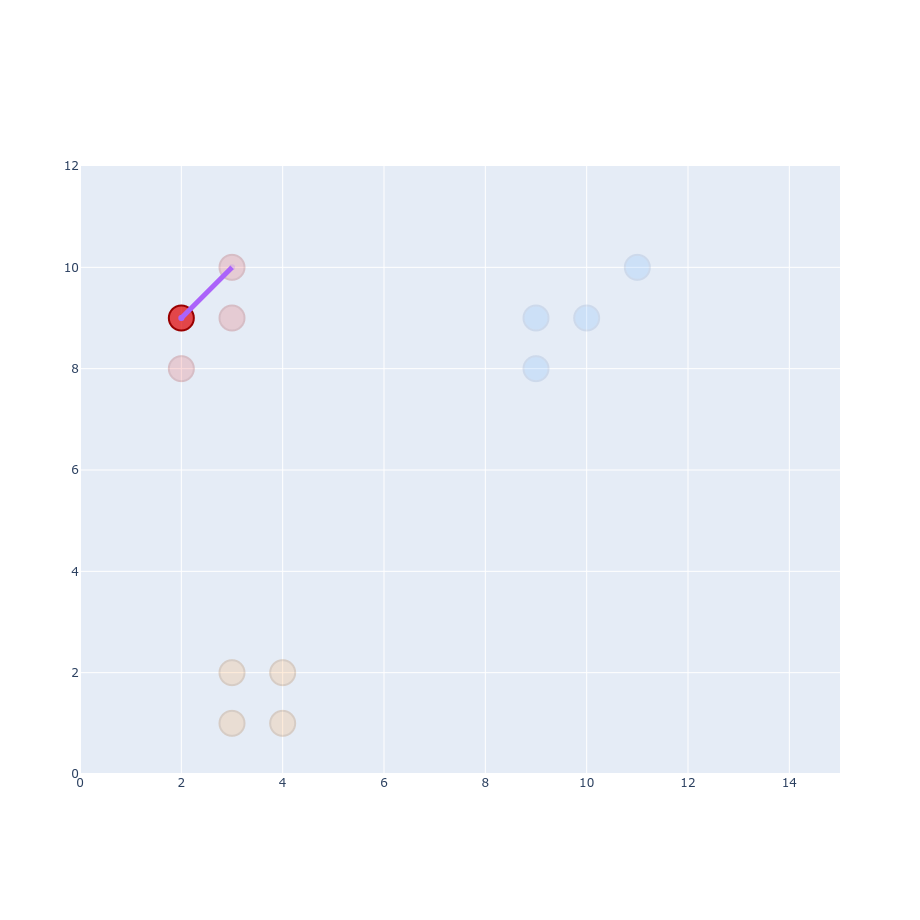
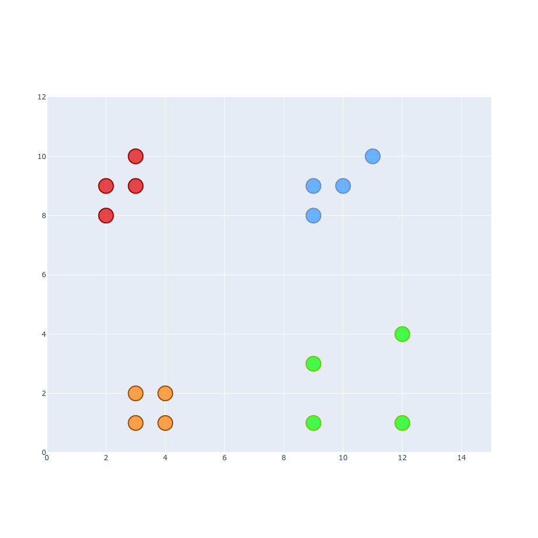
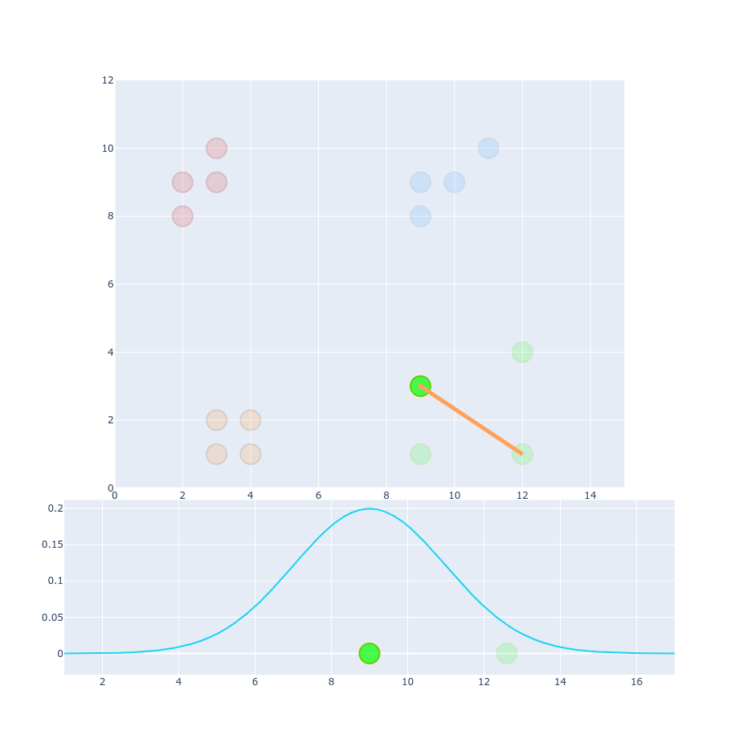
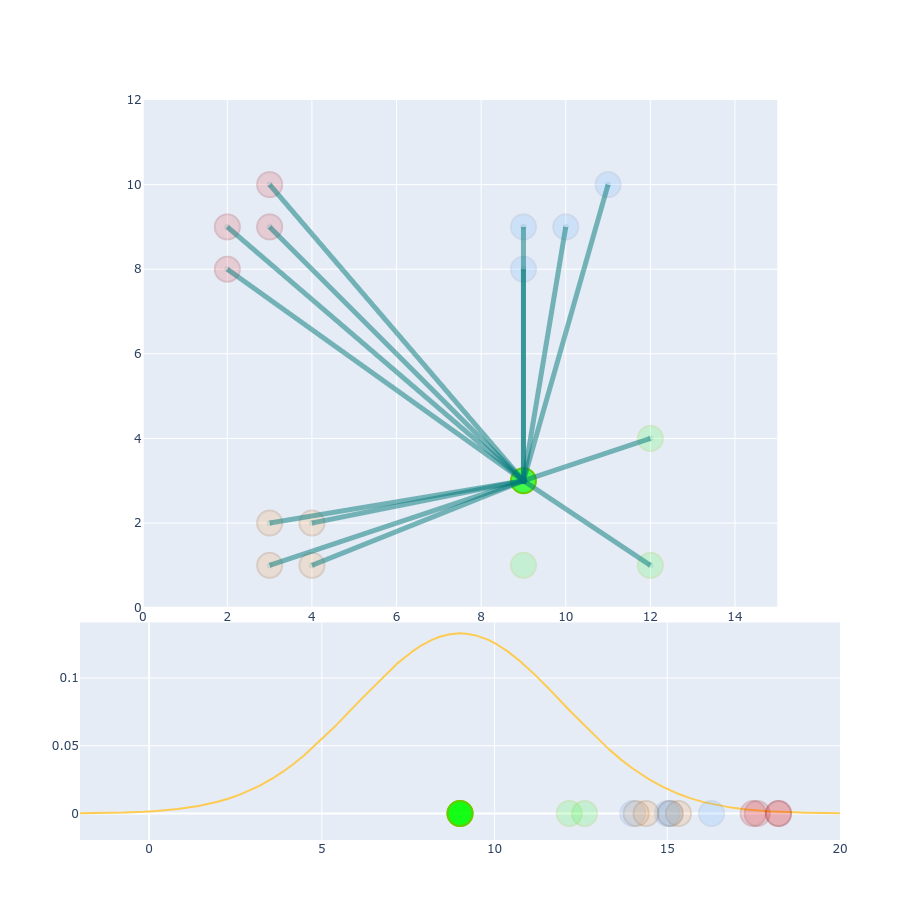
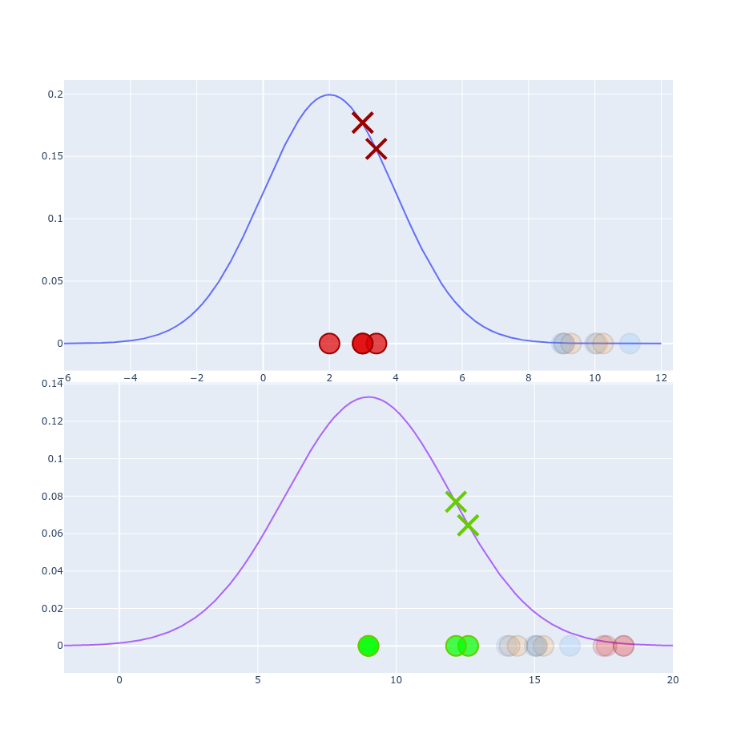
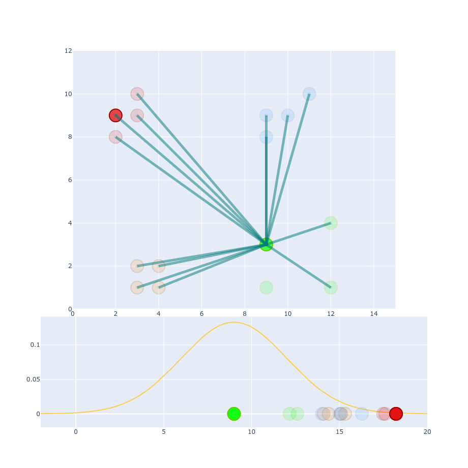
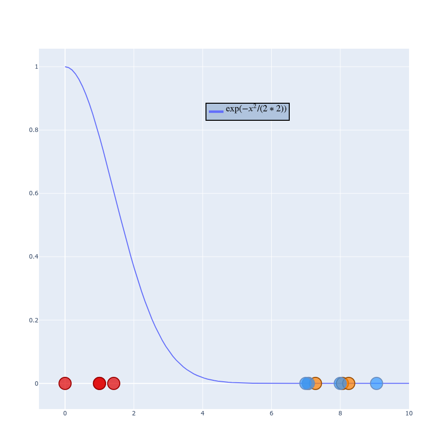
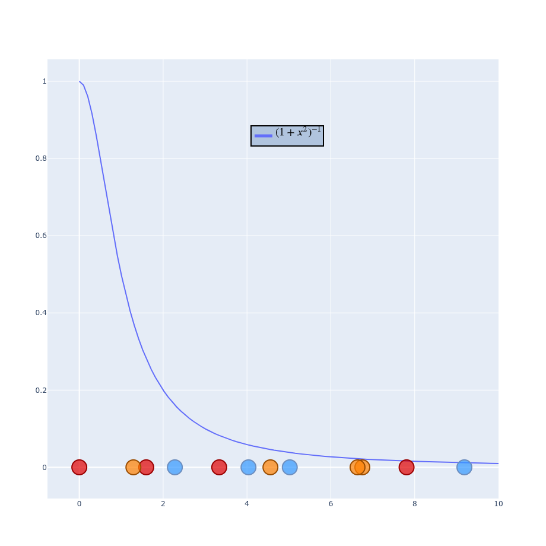
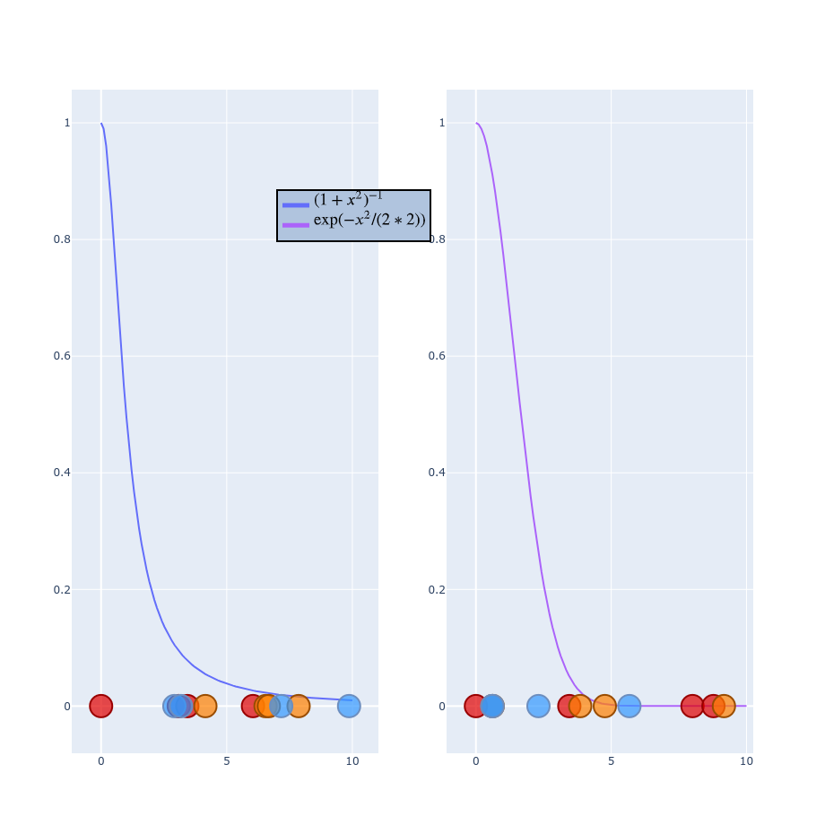

## What is **t-SNE**?

Many of you already heard about dimensionality reduction algorithms like **PCA**. One of those algorithms is called **t-SNE** (t-distributed Stochastic Neighbor Embedding). It was developed by Laurens van der Maaten and Geoffrey Hinton in 2008. You might ask "Why I should even care? I know PCA already!", and that would be a great question. t-SNE is something called **nonlinear dimensionality reduction**. What that means is this algorithm allows us to separate data that cannot be separated by any straight line, let me show you an example:

<figure class="image">
  
  
  <figcaption>Linearly nonseparable data, Source: <a href="https://distill.pub/2016/misread-tsne/" target="_blank">https://distill.pub/2016/misread-tsne/</a></figcaption>
</figure>

If you want to play with those examples go and visit [Distill](https://distill.pub/2016/misread-tsne/).

As you can imagine, those examples won't return any reasonable results when parsed through PCA (ignoring the fact that you're parsing 2D into 2D). That's why it's important to know at least one algorithm that deals with linearly nonseparable data.

You need to remember that t-SNE is iterative so unlike PCA you cannot apply it on another dataset. PCA uses the global covariance matrix does reduce data. You can get that matrix and apply it to a new set of data with the same result. That's helpful when you need to try to reduce your feature list and reuse matrix created from train data. t-SNE is mostly used to understand high-dimensional data and project it into low-dimensional space (like 2D or 3D). That makes it extremely useful when dealing with CNN networks.

## How t-SNE works?

### Probability Distribution

Let's start with **SNE** part of t-SNE. I'm far better with explaining things visually so this is going to be our dataset:

It has 3 different classes and you can easily distinguish them from each other. The first part of the algorithm is to create a **probability distribution** that represents similarities between neighbors. What is "similarity"? [Original paper][1] states "**similarity of datapoint $x_j$ to datapoint $x_i$ is the conditional probability, $p_{j|i}$, that $x_i$ would pick $x_j$ as its neighbor**". 

We've picked one of the points from the dataset. Now we have to pick another point and calculate Euclidean Distance between them $\| x_i - x_j\|$.

The next part of the original paper states that it has to be **proportional to probability density under a Gaussian centered at $x_i$**. So we have to generate Gaussian distribution with mean at $x_i$ and place our distance on the X-axis.

Right now you might wonder about $\sigma^2$ (variance) and that's a good thing. But let's just ignore it for now and assume I've already decided what it should be. After calculating the first point we have to do the same thing for every single point out there.

You might think, we're already done with this part. But that's just the beginning.

### Scattered clusters and variance

Up to this point, our clusters were tightly bounded within its group. What if we have a new cluster like that:

We should be able to apply the same process as before, shouldn't we?

We're using exactly the same $\sigma^2$ but different $\mu$ (this time it has a value of 9). If you compare projection of this point onto distribution function we can notice that value will be much less distinguishable than in the first example. The reason for that is because distances within this particular cluster are larger so you cannot apply the same $\sigma^2$ value. The obvious idea is to change it to something larger and calculate distances for resto of the points.

We're still not done. You can distinguish between similar and non-similar points but absolute values of probability are much smaller than in the first example (compare Y-axis values).

We can fix that by dividing current projection value by sum of the projections.

$$
p_{j|i} = \frac{g(| x_i - x_j|)}{\sum_{k \neq i}g(|x_i - x_k|)}
$$

Which if you apply to first example will look sth like:

$$
p_{j|i} = \frac{0.177}{0.177 + 0.177 + 0.164 + 0.0014 + 0.0013 + ...} \approx 0.34
$$

And for the second example:

$$
p_{j|i} = \frac{0.077}{0.077 + 0.064 + 0.064 + 0.032 + 0.031 + ...} \approx 0.27
$$

This scales all values to have a **sum equal to 1** ( $\sum_{j}{p_{j|i}} = 1$ ). It's good place to mention that $p_{i|i}$ is set to be equal 0 not 1.

### Dealing with different distances

If we take two points and try to calculate conditional probability between them then values of $p_{i|j}$ and $p_{j|i}$ will be different:

The reason for that is because they are coming from two different distributions. Which one should we pick to the calculation then?
$$
p_{ij}={\frac {p_{j\mid i}+p_{i\mid j}}{2N}}
$$

Where $N$ is a number of dimensions.

### The lie :)

Now when we have everything scaled to 1 (yes, the sum of all $f(x_j)$ equals 1), I can tell you that I wasn't completely honest about while the process with you :) Calculation all of that would be quite painful for the algorithm and that's not what exactly is in [t-SNE paper][1].

$$
p_{j|i} = \frac{\exp(-\left \| x_i - x_j \right \|^2 / 2\sigma_i^2)}{\sum_{k \neq i} \exp(- \left \| x_i - x_l \right \|^2 / 2\sigma_i^2)} 
$$

This is an original formula to calculate $p_{j|i}$. Why did I lie to you? First, because it's easier to get an intuition about how it works. Second, because I was going to show you the trough either way.

#### Perplexity

If you look at this formula. You can spot that our $g(|x_i - x_j|)$ is $\exp(-\left \| x_i - x_j \right \|^2 / 2\sigma_i^2)$. If I would show you this straight away, it would be hard to explain where $\sigma^2$ is coming from and what is a dependency between it and our clusters. Now you know that variance depends on Gaussian and the number of points surrounding the center of it. This is the part where **perplexity** value comes. Perplexity is more or less a target number of neighbors for our central point. Basically, the higher the perplexity is the higher value variance has. Our "red" group is close to each other and if we set perplexity to 4, it searches the right value of $\sigma$ to "fit" our 4 neighbors. If you want to be more specific then you can quote the original paper:

> SNE performs a binary search for the value of sigma that produces probability distribution with a fixed perplexity that is specified by the user

$$
Perp(P_i) = 2^{-\sum{p_{j|i}log_2p_{j|i}}}
$$

Where ${-\sum{p_{j|i}log_2p_{j|i}}}$ is **Shannon entropy**. But unless you want to implement t-SNE yourself, the only thing you need to know is that perplexity you choose is positively correlated with the value of $\mu_i$ and for the same perplexity you will have multiple different $\mu_i$, base on distances. Typical perplexity value ranges between 5 and 50.

### Oryginal formula interpretation

$$
p_{j|i} = \frac{\exp(-\left \| x_i - x_j \right \|^2 / 2\sigma_i^2)}{\sum_{k \neq i} \exp(- \left \| x_i - x_l \right \|^2 / 2\sigma_i^2)} 
$$

When you look on this formula you might notice that our Gaussian is converted into $\exp(-\left \| x_i - x_j \right \|^2 / 2\sigma_i^2)$. Let me show you how that looks like:

If you play with $\sigma^2$ for a while you can notice that the blue curve remains fixed at point $x = 0$. It only stretches when $\sigma^2$ increases.

That helps distinguish neighbor's probabilities and because you've already understood the whole process you should be able to adjust it to new values.

### Create low-dimensional space

The next part of t-SNE is to create low-dimensional space with the same number of points as in the original space. Points should be spread randomly on a new space. The goal of this algorithm is to find similar probability distribution in low-dimensional space. The most obvious choice for new distribution would be to use Gaussian again. That's not the best idea, unfortunately. One of the properties of Gaussian is that it has a "short tail" and because of that it creates a **crowding problem**. To solve that we're going to use **Student t-distribution** with a single degree of freedom. More of how this distribution was selected and why Gaussian is not the best idea you can find in the [paper][1]. I decided not to spend much time on it and allow you to read this article within a reasonable time. So now our new formula will look like:

$$
q_{ij} =\frac{(1 + \left \| y_i - y_j \right \|^2 )^{-1}}{\sum_{k \neq l} (1 + \left \| y_k - y_l \right \|^2 )^{-1} } 
$$

instead of:

$$
q_{ij} =\frac{\exp(-\left \| y_i - y_j \right \|^2 / 2\sigma_i^2)}{\sum_{k \neq l} \exp(- \left \| y_k - y_l \right \|^2 / 2\sigma_i^2)}  
$$

If you're more "visual" person this might help (values on X-axis are distributed randomly):

Using Student distribution has exactly what we need. It "falls" quickly and has a "long tail" so points won't get squashed into a single point. This time we don't have to bother with $\sigma^2$ because we don't have one in $q_{ij}$ formula. I won't generate the whole process of calculating $q_{ij}$ because it works exactly the same as $p_{ij}$. Instead, just leave you with those two formulas and skip to sth more important:

$$
p_{ij} = \frac{\exp(-\left \| x_i - x_j \right \|^2 / 2\sigma_i^2)}{\sum_{k \neq l} \exp(- \left \| x_k - x_l \right \|^2 / 2\sigma_i^2)} 
$$

$$
q_{ij} =\frac{(1 + \left \| y_i - y_j \right \|^2 )^{-1}}{\sum_{k \neq l} (1 + \left \| y_k - y_l \right \|^2 )^{-1} } 
$$

### Gradient descent

To optimize this distribution t-SNE is using [**Kullback-Leibler divergence**](https://en.wikipedia.org/wiki/Kullback%E2%80%93Leibler_divergence) between the conditional probabilities $p_{j|i}$ and $q_{j|i}$

$$
C = D_{\text{KL}}(P\parallel Q)=\sum _{x\in {\mathcal {X}}}P(x)\log \left({\frac {P(x)}{Q(x)}}\right)
$$

I'm not going through the math here because it's not important. What we need is a derivate for $y_i$ (it's derived in **Appendix A** inside the original paper).

$$
\frac{\delta C}{\delta y_i} = 4 \sum_j (p_{ij} - q_{ij})(y_i - y_j)(1 + \left \| y_i - y_j  \right \| ^2)^{-1} 
$$

You can treat that gradient as repulsion and attraction between points. A gradient is calculated for each point and describes how "strong" it should be pulled and the direction it should choose. If we start with our random 1D plane and perform gradient on the previous distribution it should look like this.

Ofc. this is an exaggeration. t-SNE doesn't run that quickly. I've just skipped a lot of steps in there to make it faster. Besides that, the values here are not completely correct, but it's good enough to show you the process.

### Tricks (optimizations) done in t-SNE to perform better

t-SNE performs well on itself but there are some improvements allow it to do even better.

#### Early Compression

To prevent early clustering t-SNE is adding L2 penalty to the cost function at the early stages. You can treat it as standard regularization because it allows the algorithm not to focus on local groups.

#### Early Exaggeration

This trick allows moving clusters of ($q_{ij}$) more. This time we're multiplying $p_{ij}$ in early stages. Because of that clusters don't get in each other's ways.

## Examples

If you remember examples from the top of the article, not it's time to show you how t-SNE solves them.

<figure class="image">
  
  
  <figcaption>Perplexity 5, Source: <a href="https://distill.pub/2016/misread-tsne/" target="_blank">https://distill.pub/2016/misread-tsne/</a></figcaption>
</figure>

<figure class="image">
  
  
  
  <figcaption>Perplexity 5(top) and 2(bottom), Source: <a href="https://distill.pub/2016/misread-tsne/" target="_blank">https://distill.pub/2016/misread-tsne/</a></figcaption>
</figure>

All runs performed 5000 iterations.

### CNN application

t-SNE is also useful when dealing with [CNN](https://en.wikipedia.org/wiki/Convolutional_neural_network) feature maps. As you might know, deep CNN networks are basically black boxes. There is no way to really interpret what's on deeper levels in the network. A common explanation is that deeper levels contain information about more complex objects. But that's not completely true, you can interpret it like that but data itself is just a high-dimensional noise for humans. But, with the help of t-SNE you can create maps to display which input data seams "similar" for the network.

One of those translations was done by [Andrej Karpathy](https://cs.stanford.edu/people/karpathy/) and it's available here [https://cs.stanford.edu/people/karpathy/cnnembed/cnn_embed_6k.jpg](https://cs.stanford.edu/people/karpathy/cnnembed/cnn_embed_6k.jpg).

What Karpathy did? He took 50k images from [LSVRC 2014](http://www.image-net.org/challenges/LSVRC/2014/) and extracted a 4096-dimensional CNN feature map (to be more precise, that 4096 map comes from fc7 layer).

<figure class="image">
  
  <figcaption>CNN Network, Source: <a href="https://ieeexplore.ieee.org/abstract/document/8688396" target="_blank">Hierarchical Localization in Topological Models Under Varying Illumination Using Holistic Visual Descriptors</a></figcaption>
</figure>

After getting that matrix for every single image, he computed a 2D embedding using t-SNE. In the end, he just generated that map with original images on 2D chart. You can easily spot which images are "similar" to each other for that particular CNN Network.

## Conclusions

t-SNE is a great tool to understand high-dimensional datasets. It might be less useful when you want to perform dimensionality reduction for ML training (cannot be reapplied in the same way). It's not deterministic and iterative so each time it runs, it could produce a different result. But even with that disadvantages it still remains one of the most popular method in the field.

### References:
- L. Maaten, G. Hinton. Visualizing Data using t-SNE, 2008 [http://www.jmlr.org/papers/volume9/vandermaaten08a/vandermaaten08a.pdf](http://www.jmlr.org/papers/volume9/vandermaaten08a/vandermaaten08a.pdf)

[1]: http://www.jmlr.org/papers/volume9/vandermaaten08a/vandermaaten08a.pdf